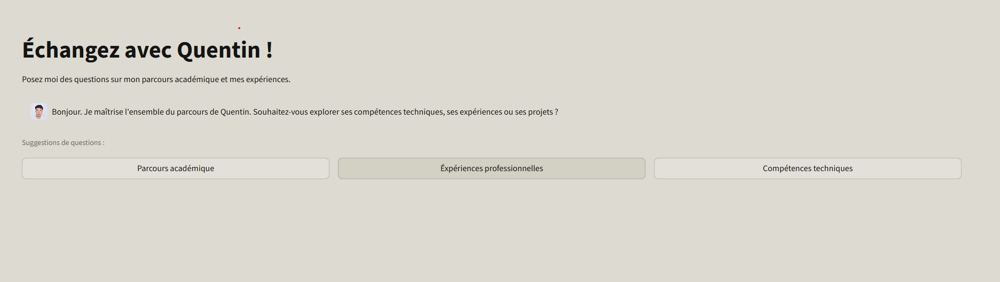

# Compte Rendu de Projet : Portfolio avec Retrieval-Augmented Generation (RAG)

**Étudiant :** Quentin Chabot  
**Superviseur :** Théo Koessler  
**Contexte :** BUT 3 Science des Données  
**Application accessible à l'adresse suivante :** [https://portfolio-llm-quentin.streamlit.app/](https://portfolio-llm-quentin.streamlit.app/)

---

## Introduction

Dans le cadre du module avancé de Science des Données en troisième année de BUT, supervisé par Théo Koessler, j'ai eu pour mission de concevoir un agent conversationnel d'un nouveau genre. L'objectif était de créer une interface intelligente capable de répondre à n'importe quelle question concernant mon parcours académique, mes expériences professionnelles et ma personnalité. Pour ce faire, j'ai développé une application reposant sur une architecture RAG (Retrieval-Augmented Generation). Ce système couple la puissance d'un agent IA, propulsé par une clé API Groq et le modèle performant `openai/gpt-oss-120b`, avec une base de données vectorielle gérée par l'outil Upstash. Ce projet a pour vocation de devenir une pièce centrale de mon portfolio personnel, offrant aux recruteurs une manière interactive et moderne de découvrir mon profil.

---

## 1. Qu'est-ce qu'un RAG et comment l'utiliser ?

### Comprendre le concept

Le RAG, ou Génération Augmentée par la Récupération, est une architecture informatique moderne conçue pour pallier les limites intrinsèques des modèles de langage classiques (LLM). En effet, un modèle standard repose uniquement sur les connaissances acquises lors de son entraînement initial, qui peuvent être rapidement obsolètes ou tout simplement incomplètes concernant des données privées. Cette technologie permet à l'intelligence artificielle de dépasser ces frontières en accédant à une base de données externe en temps réel. Son rôle principal est de servir de pont entre la capacité générative de l'IA et une source d'informations fiable et maîtrisée. Cela garantit que les réponses produites sont basées sur des faits concrets et vérifiables plutôt que sur des spéculations ou des "hallucinations" statistiques.

Le fonctionnement technique du système repose sur un cycle structuré en trois temps. Tout d'abord, la phase d'**indexation** convertit les documents textuels du projet en vecteurs numériques pour être stockés dans une base de données vectorielle. Ensuite, lorsqu'un utilisateur pose une question, le système effectue une phase de **récupération** (*retrieval*) en identifiant mathématiquement les segments d'information les plus pertinents par rapport à la requête. Enfin, la phase de **génération** intervient : le modèle de langage reçoit la question initiale accompagnée de ces extraits de texte précis pour rédiger une réponse synthétique et contextualisée. Cette méthode contraint l'IA à justifier ses propos par les documents qui lui sont fournis, fiabilisant ainsi totalement le discours.

Dans le cadre spécifique de ce projet, l'infrastructure s'appuie sur la solution Upstash Vector déployée sur les serveurs AWS en Irlande. Pour maximiser la précision des réponses fournies par le portfolio, la configuration utilise une recherche hybride combinant deux approches complémentaires. D'un côté, le modèle `bge-m3` analyse la sémantique profonde pour comprendre l'intention et le sens derrière les mots de l'utilisateur. De l'autre, l'algorithme BM25 assure une correspondance stricte par mots-clés. Cette synergie garantit que le système retrouve les informations avec une exactitude rigoureuse, que la recherche porte sur un concept général (comme "gestion de projet") ou sur un terme technique très spécifique propre à mon parcours (comme une librairie Python particulière).

---

## 2. Analyse technique du code source

### 2.1 L'ingestion des données (`src/ingest_data.py`)

Le script `src/ingest_data.py` remplit la fonction critique d'alimentation de la base de connaissances. C'est lui qui transforme les documents bruts (fichiers Markdown de mon portfolio) en données exploitables par l'intelligence artificielle. Son exécution commence par une phase indispensable de sécurisation et de nettoyage. Le programme charge les identifiants de connexion via des variables d'environnement pour accéder à l'instance Upstash Vector, puis procède systématiquement à une réinitialisation complète de l'index existant. Cette étape de suppression des anciennes données est une mesure de rigueur essentielle : elle garantit l'intégrité de la base en évitant les doublons ou la persistance d'informations obsolètes à chaque mise à jour du portfolio.

Le cœur du script repose sur une logique de segmentation intelligente du texte, techniquement appelée "chunking". Plutôt que d'importer les documents en blocs massifs ou de les couper arbitrairement par nombre de caractères, ce qui nuirait gravement à la précision des recherches, le code utilise la structure sémantique des fichiers. Il identifie les titres de niveau deux (marqués par `##`) comme des séparateurs naturels. Cette stratégie permet de découper le parcours de Quentin Chabot en unités logiques cohérentes, telles qu'un projet spécifique, une expérience professionnelle donnée ou un bloc de compétences distinct. Chaque segment ainsi créé est, de surcroît, enrichi de métadonnées indiquant sa source d'origine, garantissant une traçabilité totale lors de la phase de récupération par l'agent.

Enfin, le script est optimisé pour les performances réseau et la rapidité de traitement grâce à l'utilisation d'une opération d'envoi groupé, ou "batch upsert". Au lieu d'envoyer chaque fragment d'information individuellement via une requête réseau séparée — ce qui serait lent et inefficace — le programme compile l'ensemble des vecteurs dans une liste unique pour les injecter massivement dans la base de données en une seule fois. Cette approche industrielle réduit drastiquement le temps d'indexation et assure que le portfolio est immédiatement prêt à être interrogé. Ce script automatise donc entièrement la transformation de fichiers textes statiques en une mémoire vive et structurée.

### 2.2 L'agent IA (`src/agent.py`)

Le fichier `src/agent.py` constitue le moteur décisionnel du projet. Il transforme un modèle de langage générique en un agent autonome spécialisé, capable d'interagir intelligemment avec mes données personnelles. Cette architecture repose sur la définition d'un outil spécialisé (*Tool*), la fonction `search_portfolio`, qui sert de bras armé à l'intelligence artificielle pour aller piocher dans la base de données Upstash. Lorsqu'une question est posée par l'utilisateur, ce n'est pas le LLM qui répond directement de mémoire ; il active cet outil pour effectuer une recherche ciblée et récupérer les six segments d'information les plus pertinents mathématiquement. Chaque fragment récupéré est automatiquement associé à ses métadonnées, comme le titre ou la source, afin de fournir à l'IA un contexte riche et vérifiable.

La configuration de l'objet Agent définit ensuite la "personnalité" et les règles de conduite du système via le *System Prompt*. Contrairement à un chatbot générique qui pourrait être trop verbeux ou informel, cet agent est programmé avec des instructions strictes. Elles lui imposent un ton professionnel, direct et analytique, tout en lui interdisant formellement les formules de politesse superflues ou les aveux d'impuissance maladroits face à une information manquante. Le code intègre également une logique de synthèse qui oblige l'IA à combiner différents blocs de données (par exemple, croiser des informations de formation, d'expériences et de compétences) pour produire une réponse structurée. L'ensemble est propulsé par l'infrastructure Groq, garantissant une vitesse d'exécution quasi-instantanée du modèle, ce qui permet à l'agent de traiter la donnée et de formuler une analyse experte en une fraction de seconde.

### 2.3 L'interface Utilisateur (`src/app.py`)

L'interface graphique, point de contact entre le recruteur et l'agent, a fait l'objet d'une attention particulière. Une capture de l'interface principale est visible ci-dessous :

Concernant le développement de cette interface, j'ai fait le choix délibéré et assumé d'aller au-delà des contraintes initiales du sujet, qui limitaient l'usage du HTML et de l'assistance par IA. Mon ambition étant de déployer ce projet sur mon véritable portfolio professionnel et de le rendre accessible à de potentiels recruteurs, il était impératif de proposer une expérience utilisateur distinguée et visuellement aboutie. Si j'ai pris le soin de comprendre les mécanismes fondamentaux en suivant les ressources pédagogiques fournies avec le liens vers des outils sur le readme et le cours de présentation, j'ai reussi a le faire sans IA au début et ai compris le fonctionnement, une fois cela fait, j'ai ensuite recommencé le projet et mobilisé des outils d'assistance pour raffiner le design et l'ergonomie. Je veux livrer un produit fini de haute qualité, où l'esthétique sert la fonctionnalité, permettant au projet de se démarquer visuellement des réalisations standards.

Le fichier `src/app.py` (exécutable via `streamlit run app.py`) génère une interface épurée aux couleurs claires, conçue pour une prise en main immédiate. Une zone de texte en bas de page permet d'échanger librement avec le chatbot. Pour guider l'utilisateur en manque d'inspiration, trois boutons d'action rapide ont été intégrés, permettant de lancer instantanément des requêtes sur le parcours académique, les expériences professionnelles ou les compétences techniques.

J'ai également implémenté des fonctionnalités "intelligentes" pour enrichir l'interaction. D'une part, un système de détection de mots-clés analyse le prompt de l'utilisateur : si des termes comme "CV" ou "curriculum vitae" sont détectés, l'application génère dynamiquement un bouton de téléchargement permettant de récupérer mon CV au format PDF. D'autre part, pour convertir l'intérêt du visiteur en contact réel, j'ai instauré une logique d'engagement : au bout de quatre échanges, l'application considère que l'utilisateur est intéressé et affiche automatiquement mes canaux de contact professionnels (Email, LinkedIn, GitHub) pour l'inviter à poursuivre la discussion en dehors de l'IA, comme illustré ci-dessous :

Cette stratégie de conception transforme le projet d'un simple exercice académique en un véritable assistant de recrutement opérationnel.